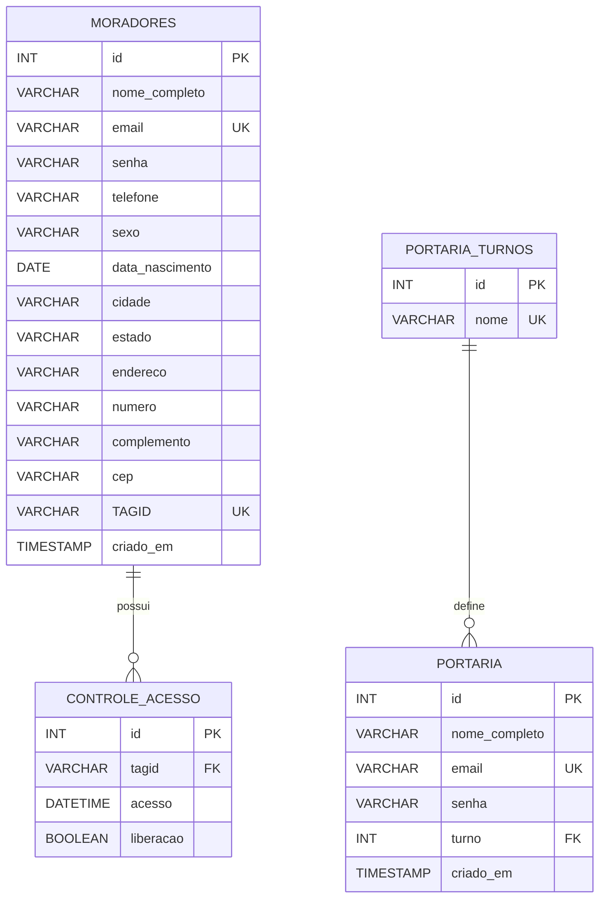

# Controle de Acessos para Condomínios

Aplicação web para cadastro de moradores, gestão de usuários da portaria, associação de TAGs RFID e consulta do histórico de acessos à portaria central.

O projeto utiliza Node.js, Express, EJS e MySQL 8. A aplicação e o banco de dados são executados em containers Docker coordenados pelo Docker Compose.

## Funcionalidades

### Morador

- Cadastro e autenticação independentes.
- Menu exclusivo após o login.
- Consulta e atualização dos próprios dados.
- Nome e TAGID protegidos contra alteração pelo morador.
- Consulta exclusiva do próprio histórico de acessos.
- Filtros combináveis por data e situação.
- Situações apresentadas como `Liberado` ou `Bloqueado`.

### Portaria

- Cadastro e autenticação independentes.
- Edição protegida do próprio usuário e turno.
- Localização de morador por e-mail.
- Associação e substituição confirmada de TAGID.
- Consulta de todos os acessos à portaria central.
- Filtros combináveis por data, e-mail do morador e situação.

## Tecnologias

| Componente | Tecnologia |
|---|---|
| Backend | Node.js 22 e Express 5 |
| Templates | EJS 3 |
| Banco de dados | MySQL 8 |
| Acesso ao banco | mysql2/promise |
| Autenticação | express-session e bcrypt |
| Frontend | HTML, CSS e JavaScript |
| Containers | Docker e Docker Compose |

## Estrutura do projeto

```text
.
├── compose.yaml
├── Dockerfile
├── package.json
├── server.js
├── condoservicos.sql
├── public/
│   ├── cadastro_morador/
│   ├── cadastro_portaria/
│   ├── gestao/
│   ├── home/
│   └── login/
└── views/
    ├── acessos_morador.ejs
    ├── cadastro_morador.ejs
    ├── cadastro_portaria.ejs
    ├── cadastro_tag_morador.ejs
    ├── edicao_morador.ejs
    ├── editar_portaria.ejs
    ├── gestao.ejs
    ├── home.ejs
    ├── lista_acesso_gestao.ejs
    ├── login.ejs
    ├── login_morador.ejs
    └── menu_morador.ejs
```

## Arquitetura Docker

O arquivo `compose.yaml` define dois serviços:

| Serviço | Imagem | Porta publicada | Persistência |
|---|---|---|---|
| `app` | Construída pelo `Dockerfile` com Node.js 22 | `3001:3000` | Código incorporado à imagem |
| `db` | `mysql:8.0` | `3306:3306` | Volume `mysql_data` |

O serviço `app` só inicia depois que o healthcheck do MySQL informa que o banco está saudável.

## Lista de TAGs para o dispositivo

A aplicação publica o blob `tags-autorizadas.json` no container `residentes` ao iniciar e depois de cada cadastro, alteração ou remoção de TAG feita pela tela de cadastro de TAG do morador. O arquivo contém somente TAGs associadas a moradores:

```json
{
    "version": "2026-09-15T18:30:00.000Z",
    "generatedAt": "2026-09-15T18:30:00.000Z",
    "tags": [
        { "tagid": "23 7E 5B 63" }
    ]
}
```

Quando não existem TAGs cadastradas, `tags` é um array vazio. No Azure, o upload usa a Managed Identity atribuída ao Container App; nenhuma chave do Storage é armazenada na aplicação.

## Modelo de dados



### Relacionamentos

- `controle-acesso.tagid` referencia `moradores.TAGID`: um morador pode possuir vários registros de acesso.
- `portaria.turno` referencia `portaria-turnos.id`: um turno pode estar associado a vários usuários da portaria.
- `moradores.email`, `moradores.TAGID`, `portaria.email` e `portaria-turnos.nome` são únicos.
- O MySQL armazena `BOOLEAN` como `TINYINT(1)`: `1` representa liberado e `0` representa bloqueado.

O `server.js` cria as tabelas, índices, relacionamentos e turnos iniciais de maneira idempotente ao iniciar a aplicação.

## Rotas

### Públicas

| Método | Rota | Finalidade |
|---|---|---|
| GET | `/` | Redireciona para `/home` |
| GET | `/home` | Página inicial |
| GET/POST | `/login` | Autenticação da portaria |
| GET/POST | `/login-morador` | Autenticação do morador |
| GET/POST | `/cadastro-portaria` | Cadastro de usuário da portaria |
| GET/POST | `/cadastro-morador` | Cadastro de morador |
| GET | `/logout` | Encerra a sessão |

### Protegidas da portaria

| Método | Rota | Finalidade |
|---|---|---|
| GET | `/gestao` | Menu da portaria |
| GET | `/lista-acesso-gestao` | Histórico geral com filtros |
| POST | `/gestao/acessar-edicao-portaria` | Autoriza o fluxo de edição |
| GET/POST | `/gestao/editar-portaria` | Edição do usuário autenticado |
| GET/POST | `/gestao/cadastro-tag-morador` | Associação de TAG ao morador |

### Protegidas do morador

| Método | Rota | Finalidade |
|---|---|---|
| GET | `/menu-morador` | Menu do morador |
| GET/POST | `/edicao-morador` | Edição do próprio cadastro |
| GET | `/acessos-morador` | Histórico exclusivo do morador |

## Variáveis de ambiente

Crie `.env` a partir de `.env.example`:

```powershell
Copy-Item .env.example .env
```

| Variável | Descrição | Exemplo |
|---|---|---|
| `PORT` | Porta interna da aplicação | `3000` |
| `NODE_ENV` | Ambiente de execução | `development` |
| `DB_HOST` | Host MySQL; no Compose deve ser `db` | `db` |
| `DB_PORT` | Porta interna do MySQL | `3306` |
| `DB_NAME` | Nome do banco | `condoservicos` |
| `DB_USER` | Usuário da aplicação | `condoservicos` |
| `DB_PASSWORD` | Senha do usuário da aplicação | Definida localmente |
| `DB_ROOT_PASSWORD` | Senha root usada pelo container MySQL | Definida localmente |
| `SESSION_SECRET` | Segredo de assinatura das sessões | Valor longo e aleatório |
| `DB_SSL` | Ativa SSL no cliente MySQL quando `true` | `false` |

As variáveis `EMAIL_ENABLED`, `EMAIL_USER`, `EMAIL_PASSWORD` e `EMAIL_TO` estão reservadas no exemplo de ambiente, mas o envio de e-mails não faz parte dos fluxos atuais.

Nunca publique o arquivo `.env`. Em produção, substitua todas as credenciais de exemplo e use um `SESSION_SECRET` forte.

## Execução com Docker

### Pré-requisitos

- Docker Desktop ou Docker Engine com Docker Compose.
- Portas `3001` e `3306` disponíveis.

### Primeira execução

```powershell
Copy-Item .env.example .env
docker compose up -d --build
docker compose ps
docker compose logs app --tail 30
```

Acesse:

```text
http://localhost:3001/home
```

O banco é criado automaticamente. Sem restauração de backup, as tabelas estarão vazias, exceto pelos turnos iniciais.

### Parar e iniciar

```powershell
docker compose stop
docker compose start
```

Também é possível recriar os containers preservando o volume do banco:

```powershell
docker compose down
docker compose up -d
```

### Reconstruir após alterar o código

```powershell
docker compose build --no-cache app
docker compose up -d app
```

Ou em um único comando:

```powershell
docker compose up -d --build
```

## Backup e restauração

O arquivo `condoservicos.sql` é um dump completo da estrutura, relacionamentos e dados existentes no momento de sua geração.

### Gerar um novo backup

```powershell
$db = docker compose ps -q db

docker exec $db sh -c 'mysqldump -u"$MYSQL_USER" -p"$MYSQL_PASSWORD" --single-transaction --routines --triggers --events --hex-blob --no-tablespaces --set-gtid-purged=OFF "$MYSQL_DATABASE" > /tmp/condoservicos.sql'

docker cp "${db}:/tmp/condoservicos.sql" .\condoservicos.sql
docker exec $db rm /tmp/condoservicos.sql
```

### Restaurar o backup em um volume novo

Suba somente o banco:

```powershell
docker compose up -d --wait db
$db = docker compose ps -q db
```

Copie e restaure o dump:

```powershell
docker cp .\condoservicos.sql "${db}:/tmp/condoservicos.sql"

docker exec $db sh -c 'mysql -u"$MYSQL_USER" -p"$MYSQL_PASSWORD" "$MYSQL_DATABASE" < /tmp/condoservicos.sql'

docker exec $db rm /tmp/condoservicos.sql
docker compose up -d app
```

Para restaurar sobre um banco que já contém dados, faça primeiro um backup atualizado. O dump inclui comandos de remoção e recriação das tabelas.

## Transporte para máquina sem possibilidade de build

Use este fluxo quando a máquina de destino pode executar Docker, mas não pode baixar dependências nem construir a aplicação por restrições de segurança.

### Na máquina de origem

Construa e identifique a imagem da aplicação:

```powershell
docker compose build --no-cache app
$appImage = docker compose images -q app
docker tag $appImage condoservicos-app:1.0
```

Exporte as imagens da aplicação e do MySQL:

```powershell
docker pull mysql:8.0
docker save -o condoservicos-imagens.tar condoservicos-app:1.0 mysql:8.0
```

Gere um backup atualizado usando o procedimento da seção anterior. Transfira para a máquina de destino:

- O projeto completo.
- `condoservicos-imagens.tar`.
- `condoservicos.sql`.
- Um `.env` apropriado para a máquina de destino.

### Ajuste do Compose no destino

Adicione a propriedade `image` ao serviço `app` em `compose.yaml`, mantendo as demais configurações:

```yaml
app:
  image: condoservicos-app:1.0
  build:
    context: .
```

### Na máquina de destino

Importe as imagens:

```powershell
docker load -i .\condoservicos-imagens.tar
```

Suba o banco sem construir imagens, restaure o dump e inicie a aplicação:

```powershell
docker compose up -d --no-build db
$db = docker compose ps -q db

docker cp .\condoservicos.sql "${db}:/tmp/condoservicos.sql"
docker exec $db sh -c 'mysql -u"$MYSQL_USER" -p"$MYSQL_PASSWORD" "$MYSQL_DATABASE" < /tmp/condoservicos.sql'
docker exec $db rm /tmp/condoservicos.sql

docker compose up -d --no-build app
docker compose ps
```

## Execução sem Docker

Esta opção exige Node.js 22 e MySQL 8 instalados localmente:

```powershell
npm install
Copy-Item .env.example .env
npm start
```

No `.env`, altere `DB_HOST` para o endereço do MySQL, por exemplo `127.0.0.1`. Sem o mapeamento Docker, a aplicação fica disponível na porta configurada em `PORT`, normalmente `http://localhost:3000/home`.

## Segurança e operação

- Senhas são armazenadas como hashes bcrypt.
- A sessão é regenerada depois da autenticação.
- Cookies de sessão usam `httpOnly` e `sameSite=strict`.
- Rotas de morador e portaria possuem guards separados.
- Consultas e atualizações usam parâmetros SQL.
- O histórico do morador é limitado pelo ID armazenado na sessão, não por parâmetros recebidos do navegador.
- A chave estrangeira de TAG impede registros de acesso para uma TAG inexistente.
- A sessão padrão usa armazenamento em memória. Para produção com múltiplas instâncias, use um session store persistente, como Redis ou MySQL.
- Com `NODE_ENV=production`, o cookie é marcado como seguro e requer HTTPS.
- O dump `condoservicos.sql` contém dados pessoais e hashes de senha. Trate-o como arquivo confidencial e não o publique em repositórios públicos.

## Comandos úteis

```powershell
# Estado dos serviços
docker compose ps

# Logs da aplicação
docker compose logs -f app

# Logs do MySQL
docker compose logs -f db

# Reiniciar a aplicação
docker compose restart app

# Abrir cliente MySQL no container
docker compose exec db sh -c 'mysql -u"$MYSQL_USER" -p"$MYSQL_PASSWORD" "$MYSQL_DATABASE"'
```

## Atenção ao volume do banco

O comando abaixo remove containers **e apaga definitivamente o volume do MySQL**:

```powershell
docker compose down -v
```

Use-o somente quando desejar reinicializar completamente o banco e possuir um backup válido.