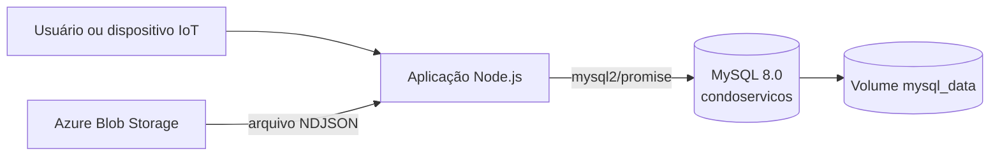
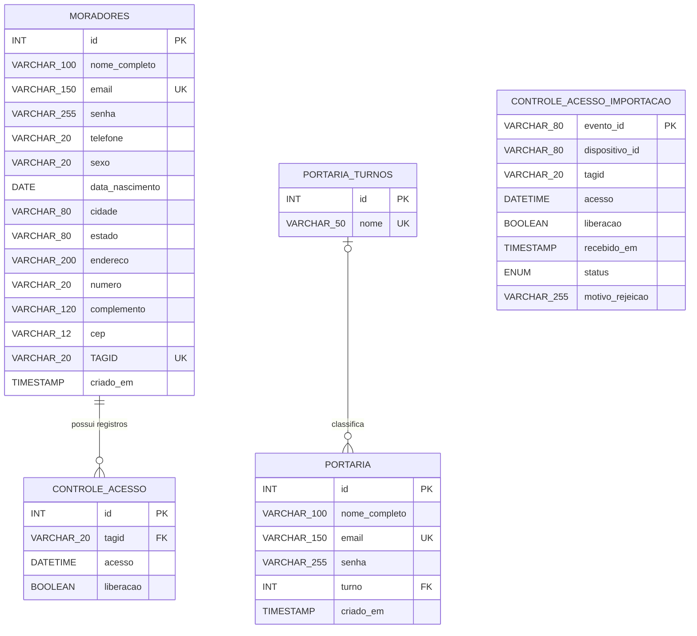
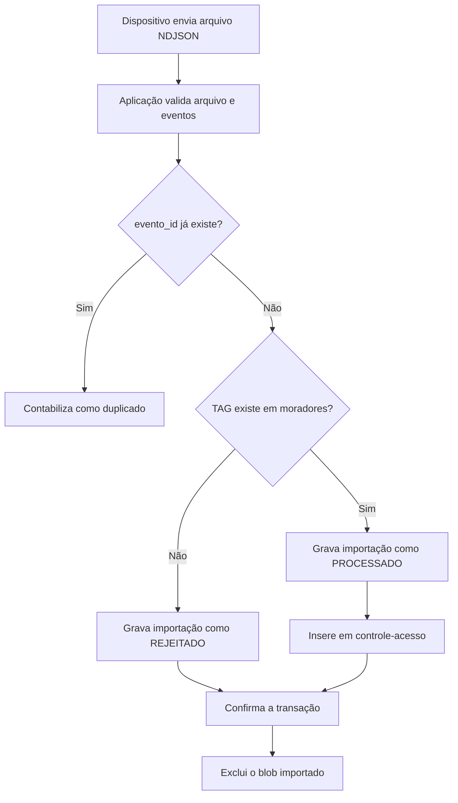

# Documentação do banco de dados MySQL

## 1. Visão geral

O CondoAcesso utiliza o **MySQL 8.0** para armazenar moradores, usuários da
portaria, turnos e eventos de acesso. A aplicação acessa o banco por meio do
driver `mysql2/promise`, usando um pool de conexões.

| Item | Valor |
|---|---|
| SGBD | MySQL 8.0 |
| Banco padrão | `condoservicos` |
| Engine das tabelas | InnoDB |
| Codificação | `utf8mb4` |
| Collation do dump | `utf8mb4_0900_ai_ci` |
| Porta padrão | `3306` |
| Criação e evolução do esquema | Função `initDatabase()` em `server.js` |
| Backup disponível | `condoservicos.sql` |

> O esquema descrito neste documento considera a estrutura criada pela
> aplicação. O dump `condoservicos.sql`, gerado em 02/09/2026, contém quatro
> tabelas e não contém `controle_acesso_importacao`, que é criada
> automaticamente por `server.js` na inicialização.

## 2. Arquitetura de execução

No ambiente Docker Compose, o banco é executado pelo serviço `db`, com a imagem
`mysql:8.0`. Os dados são persistidos no volume nomeado `mysql_data`, montado em
`/var/lib/mysql`.



O serviço da aplicação aguarda o `healthcheck` do MySQL antes de iniciar. O
teste de saúde usa `mysqladmin ping`.

### Variáveis de conexão

| Variável | Finalidade | Valor padrão da aplicação |
|---|---|---|
| `DB_HOST` | Host do servidor MySQL | `db` |
| `DB_PORT` | Porta do servidor MySQL | `3306` |
| `DB_NAME` | Nome do banco | `condoservicos` |
| `DB_USER` | Usuário da aplicação | `condoservicos` |
| `DB_PASSWORD` | Senha do usuário da aplicação | Deve ser definida no ambiente |
| `DB_ROOT_PASSWORD` | Senha do `root` usada pelo container | Deve ser definida no ambiente |
| `DB_SSL` | Ativa TLS quando igual a `true` | `false` |
| `DB_SSL_MODE` | Também ativa TLS quando igual a `REQUIRED` | Não definido |

Quando o SSL está habilitado, o cliente exige no mínimo TLS 1.2 e valida o
certificado do servidor.

## 3. Diagrama entidade-relacionamento



### Leitura das cardinalidades

- Um registro de `moradores` pode possuir zero ou muitos registros em
  `controle-acesso`.
- Cada registro de `controle-acesso` deve pertencer a exatamente um morador,
  identificado pela TAG.
- Um registro de `portaria-turnos` pode ser associado a zero ou muitos usuários
  de `portaria`.
- O campo `portaria.turno` aceita `NULL`; portanto, um usuário de portaria pode
  estar temporariamente sem turno.
- `controle_acesso_importacao` não possui chave estrangeira. Isso é
  intencional: a tabela também precisa registrar tentativas feitas com TAGs
  desconhecidas.

## 4. Dicionário de dados

### 4.1. Tabela `moradores`

Armazena os dados cadastrais e de autenticação dos moradores. A TAG RFID é
opcional no cadastro, mas, quando informada, deve ser exclusiva.

| Coluna | Tipo | Nulo | Chave/padrão | Descrição |
|---|---|---:|---|---|
| `id` | `INT` | Não | PK, auto incremento | Identificador do morador |
| `nome_completo` | `VARCHAR(100)` | Não | — | Nome completo |
| `email` | `VARCHAR(150)` | Não | UNIQUE | E-mail usado na autenticação |
| `senha` | `VARCHAR(255)` | Não | — | Hash bcrypt da senha |
| `telefone` | `VARCHAR(20)` | Sim | `NULL` | Telefone formatado |
| `sexo` | `VARCHAR(20)` | Sim | `NULL` | Gênero informado |
| `data_nascimento` | `DATE` | Sim | `NULL` | Data de nascimento |
| `cidade` | `VARCHAR(80)` | Sim | `NULL` | Cidade |
| `estado` | `VARCHAR(80)` | Sim | `NULL` | Estado |
| `endereco` | `VARCHAR(200)` | Sim | `NULL` | Logradouro |
| `numero` | `VARCHAR(20)` | Sim | `NULL` | Número do endereço |
| `complemento` | `VARCHAR(120)` | Sim | `NULL` | Complemento do endereço |
| `cep` | `VARCHAR(12)` | Sim | `NULL` | CEP |
| `TAGID` | `VARCHAR(20)` | Sim | UNIQUE, `NULL` | Identificador normalizado da TAG RFID |
| `criado_em` | `TIMESTAMP` | Sim | `CURRENT_TIMESTAMP` | Data e hora do cadastro |

Formato adotado para TAGs: quatro bytes hexadecimais maiúsculos separados por
espaço, por exemplo `A1 B2 C3 D4`.

### 4.2. Tabela `controle-acesso`

Armazena o histórico final de acessos associados a TAGs cadastradas.

| Coluna | Tipo | Nulo | Chave/padrão | Descrição |
|---|---|---:|---|---|
| `id` | `INT` | Não | PK, auto incremento | Identificador do registro |
| `tagid` | `VARCHAR(20)` | Não | FK | TAG usada no acesso |
| `acesso` | `DATETIME` | Não | — | Data e hora do evento |
| `liberacao` | `BOOLEAN` | Não | — | Resultado da decisão de acesso |

No MySQL, `BOOLEAN` é um sinônimo de `TINYINT(1)`:

- `1`: acesso liberado;
- `0`: acesso bloqueado.

### 4.3. Tabela `controle_acesso_importacao`

Funciona como trilha de auditoria e mecanismo de idempotência para os eventos
recebidos de dispositivos IoT.

| Coluna | Tipo | Nulo | Chave/padrão | Descrição |
|---|---|---:|---|---|
| `evento_id` | `VARCHAR(80)` | Não | PK | Identificador único enviado pelo dispositivo |
| `dispositivo_id` | `VARCHAR(80)` | Não | Índice composto | Dispositivo que originou o evento |
| `tagid` | `VARCHAR(20)` | Não | — | TAG informada pelo dispositivo |
| `acesso` | `DATETIME` | Não | Índice composto | Data e hora UTC do evento |
| `liberacao` | `BOOLEAN` | Não | — | Decisão registrada pelo dispositivo |
| `recebido_em` | `TIMESTAMP` | Não | `CURRENT_TIMESTAMP` | Momento da importação |
| `status` | `ENUM('PROCESSADO', 'REJEITADO')` | Não | — | Resultado da importação |
| `motivo_rejeicao` | `VARCHAR(255)` | Sim | `NULL` | Motivo de um evento rejeitado |

O `evento_id` como chave primária impede que o mesmo evento seja processado
mais de uma vez. A aplicação usa `INSERT IGNORE` e contabiliza uma tentativa
repetida como duplicada.

### 4.4. Tabela `portaria-turnos`

Tabela de domínio dos turnos disponíveis para os usuários da portaria.

| Coluna | Tipo | Nulo | Chave/padrão | Descrição |
|---|---|---:|---|---|
| `id` | `INT` | Não | PK, auto incremento | Identificador do turno |
| `nome` | `VARCHAR(50)` | Não | UNIQUE | Nome exclusivo do turno |

Valores iniciais inseridos de forma idempotente:

1. `Turno Diurno`
2. `Turno Noturno`
3. `Turno 1`
4. `Turno 2`
5. `Turno 3`

### 4.5. Tabela `portaria`

Armazena os usuários responsáveis pela operação da portaria.

| Coluna | Tipo | Nulo | Chave/padrão | Descrição |
|---|---|---:|---|---|
| `id` | `INT` | Não | PK, auto incremento | Identificador do usuário |
| `nome_completo` | `VARCHAR(100)` | Não | — | Nome completo |
| `email` | `VARCHAR(150)` | Não | UNIQUE | E-mail usado na autenticação |
| `senha` | `VARCHAR(255)` | Não | — | Hash bcrypt da senha |
| `turno` | `INT` | Sim | FK, `NULL` | Turno associado |
| `criado_em` | `TIMESTAMP` | Sim | `CURRENT_TIMESTAMP` | Data e hora do cadastro |

## 5. Relacionamentos e integridade referencial

### Morador e controle de acesso

```text
moradores.TAGID  1 ─────── N  controle-acesso.tagid
```

- Restrição: `fk_controle_acesso_morador_tagid`.
- A TAG referenciada deve existir em `moradores`.
- `ON UPDATE CASCADE`: quando uma TAG é alterada no cadastro do morador, todos
  os registros relacionados em `controle-acesso` recebem a nova TAG.
- Não há `ON DELETE CASCADE`; o comportamento padrão é `RESTRICT`. Assim, um
  morador ou uma TAG com histórico relacionado não pode ser removido enquanto
  existirem registros dependentes.
- Como `moradores.TAGID` é `UNIQUE`, uma TAG pertence a no máximo um morador.

### Turno e usuário da portaria

```text
portaria-turnos.id  1 ─────── N  portaria.turno
```

- Restrição: `fk_portaria_turno`.
- O turno informado deve existir em `portaria-turnos`.
- Como `portaria.turno` aceita `NULL`, o vínculo é opcional.
- Não há ações de cascata configuradas para atualização ou exclusão.

### Importação de acesso

`controle_acesso_importacao.tagid` não referencia `moradores.TAGID`. Um evento
com TAG inexistente deve continuar registrado com status `REJEITADO` e motivo
`TAG não cadastrada.`. Somente eventos aceitos são copiados para
`controle-acesso`.

## 6. Chaves e índices

| Tabela | Índice/restrição | Coluna(s) | Finalidade |
|---|---|---|---|
| `moradores` | PRIMARY KEY | `id` | Identificação do morador |
| `moradores` | UNIQUE | `email` | Impedir e-mails duplicados |
| `moradores` | `uq_moradores_tagid` UNIQUE | `TAGID` | Impedir uma TAG em mais de um morador |
| `controle-acesso` | PRIMARY KEY | `id` | Identificação do evento |
| `controle-acesso` | `fk_controle_acesso_morador_tagid` | `tagid` | Suporte à chave estrangeira e consultas por TAG |
| `controle_acesso_importacao` | PRIMARY KEY | `evento_id` | Idempotência dos eventos |
| `controle_acesso_importacao` | `idx_importacao_dispositivo_acesso` | `dispositivo_id`, `acesso` | Busca cronológica por dispositivo |
| `portaria-turnos` | PRIMARY KEY | `id` | Identificação do turno |
| `portaria-turnos` | UNIQUE | `nome` | Impedir nomes de turno duplicados |
| `portaria` | PRIMARY KEY | `id` | Identificação do usuário |
| `portaria` | UNIQUE | `email` | Impedir e-mails duplicados |
| `portaria` | `fk_portaria_turno` | `turno` | Suporte ao relacionamento com turnos |

## 7. Fluxo de persistência dos acessos



Todo o lote é processado dentro de uma transação:

1. a aplicação inicia a transação;
2. verifica se cada TAG existe;
3. registra o evento em `controle_acesso_importacao`;
4. para uma TAG válida, também insere em `controle-acesso`;
5. confirma o lote com `COMMIT`;
6. em caso de erro, desfaz o lote inteiro com `ROLLBACK`;
7. o arquivo no Blob Storage só é excluído após a transação ser concluída.

## 8. Inicialização e evolução do esquema

A função `initDatabase()` é executada antes de o servidor começar a aceitar
requisições. Ela:

1. cria as cinco tabelas com `CREATE TABLE IF NOT EXISTS`;
2. garante o índice único de `moradores.TAGID`;
3. garante que a chave estrangeira de acesso use `ON UPDATE CASCADE`;
4. insere os cinco turnos padrão com `INSERT IGNORE`;
5. cria o campo e o relacionamento de turno em instalações antigas;
6. remove da tabela `portaria` campos cadastrais antigos que pertencem somente
   aos moradores.

Esse processo permite iniciar tanto um banco vazio quanto atualizar estruturas
anteriores sem recriar todo o banco.

## 9. Consultas principais da aplicação

### Histórico de um morador

O histórico é obtido pelo relacionamento entre a TAG do morador autenticado e
os registros de acesso:

```sql
SELECT ca.id, ca.tagid, ca.acesso, ca.liberacao
FROM `controle-acesso` AS ca
INNER JOIN moradores AS m ON m.TAGID = ca.tagid
WHERE m.id = ?
ORDER BY ca.acesso DESC, ca.id DESC;
```

### Histórico geral da portaria

A listagem da portaria combina:

- eventos processados de `controle-acesso`, associados a `moradores`;
- eventos negados de `controle_acesso_importacao`, mesmo sem morador;
- filtros opcionais por data, e-mail e situação;
- `UNION ALL` quando todas as situações são exibidas.

### Lista de TAGs autorizadas

```sql
SELECT TAGID AS tagid
FROM moradores
WHERE TAGID IS NOT NULL AND TRIM(TAGID) <> ''
ORDER BY TAGID;
```

O resultado é publicado no Azure Blob Storage para consumo pelos dispositivos.

## 10. Segurança e tratamento dos dados

- As senhas não são gravadas em texto puro; a aplicação armazena hashes bcrypt.
- As consultas que recebem dados externos usam parâmetros `?`.
- E-mails são normalizados para letras minúsculas antes da persistência ou
  consulta.
- TAGs são normalizadas e validadas antes de serem armazenadas.
- A chave estrangeira impede a criação de um acesso final para uma TAG
  inexistente.
- A chave primária de `controle_acesso_importacao` evita reprocessamento.
- O usuário da aplicação deve ter somente as permissões necessárias no banco.
- O dump pode conter dados pessoais e hashes de senha e deve ser tratado como
  arquivo confidencial.

## 11. Backup e restauração

### Gerar o dump

```powershell
$db = docker compose ps -q db

docker exec $db sh -c 'mysqldump -u"$MYSQL_USER" -p"$MYSQL_PASSWORD" --single-transaction --routines --triggers --events --hex-blob --no-tablespaces --set-gtid-purged=OFF "$MYSQL_DATABASE" > /tmp/condoservicos.sql'
docker cp "${db}:/tmp/condoservicos.sql" .\condoservicos.sql
docker exec $db rm /tmp/condoservicos.sql
```

### Restaurar o dump

```powershell
docker compose up -d --wait db
$db = docker compose ps -q db

docker cp .\condoservicos.sql "${db}:/tmp/condoservicos.sql"
docker exec $db sh -c 'mysql -u"$MYSQL_USER" -p"$MYSQL_PASSWORD" "$MYSQL_DATABASE" < /tmp/condoservicos.sql'
docker exec $db rm /tmp/condoservicos.sql
docker compose up -d app
```

Após restaurar um dump antigo, a inicialização da aplicação cria estruturas
posteriores ausentes, como `controle_acesso_importacao`.

## 12. Operação

### Abrir o cliente MySQL

```powershell
docker compose exec db sh -c 'mysql -u"$MYSQL_USER" -p"$MYSQL_PASSWORD" "$MYSQL_DATABASE"'
```

### Verificar o serviço

```powershell
docker compose ps
docker compose logs db --tail 50
```

### Persistência do volume

`docker compose down` remove os containers, mas preserva `mysql_data`. Já o
comando abaixo também apaga definitivamente os dados:

```powershell
docker compose down -v
```

Ele deve ser usado somente quando houver intenção de reinicializar o banco e um
backup válido estiver disponível.

## 13. Fontes desta documentação

- `server.js`: definição atual e evolução idempotente do esquema.
- `condoservicos.sql`: estrutura e dados existentes no momento do dump.
- `compose.yaml`: serviço MySQL, volume, porta e teste de saúde.
- `.env.example`: parâmetros esperados para conexão.

